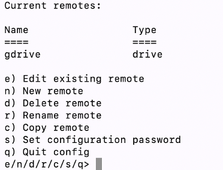
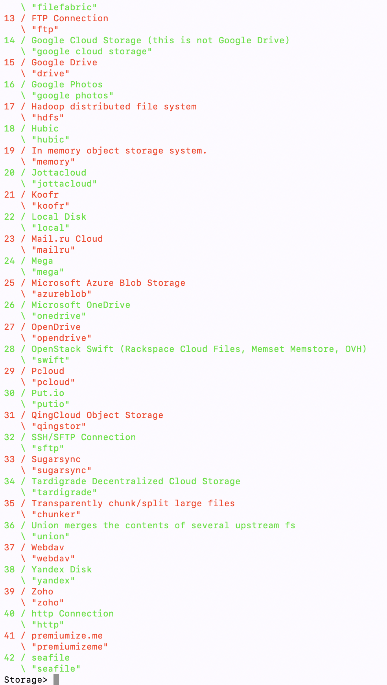
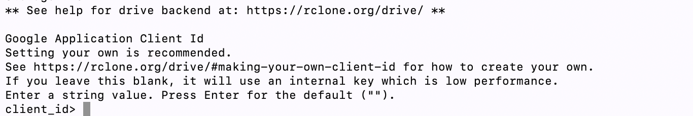
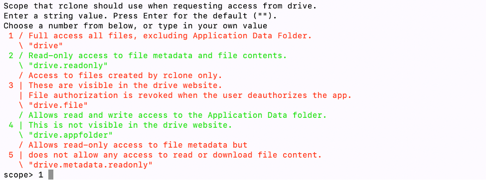
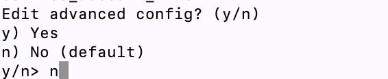
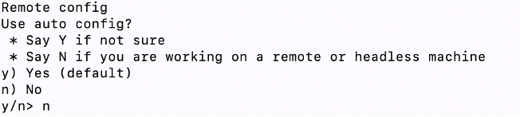
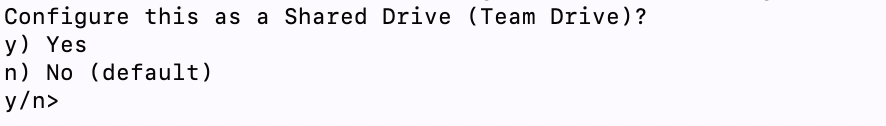

# Configuring rclone for gdrive  

1. On the machine where you wish to download the files, create a remote called `gdrive`
   (or any name you like) as follows:

   * Open a terminal window (**terminal 1**). After installing rclone on the server, type `rclone config`, you will see something like this:

     

     Choose `n`. If you do not have a remote before, you will not see those ‘current remotes’ things.

   * Then you need to input the remote name. Here we use ‘drive’. After inputting the name, and you will see something like this: 

     

     We are using Google drive, so input `15`. 

   * Then you will see the request for client_id and client_secret. 

     

     The client_id and client_secret should be created following the instructions: https://rclone.org/drive/#making-your-own-client-id
     Please make sure that the Google account used to create the client_id and client_secret is a generic account.

   * After you input the client_id and client_secret, you should see the option to set the scope that rclone uses. 

     

   * You should see the request for ‘root_folder_id’. Just press enter and leave this blank.

   * You should see the request for ‘service_account_file’. Also press enter and leave this blank. 

   * You should see this. Type `n`.

     

   * You should see the question `Use auto config?`. Choose `n`. 

     

   * The, a link would be given to get a verification code.

   * You will be asked: it will ask whether to configure this as a Shared Drive.

     

     We say no (`n`) here.

   * Then, it will give you the information of the remote. After confirming the information, the remote called `gdrive` would be created successfully. 

   * Finally, type `q` to exit the config. 

2. Mount the remote Google drive on the machine:

   * Create a directory by `mkdir drive` (or any name you like).

   * Then, mount the directory using command `rclone mount gdrive: drive`.

   * Keep this terminal window (**terminal 1**) in order to keep the 
     remote drive mounted.

   * Open a new terminal window (**terminal 2**) and `cd drive`
     to navigate to the remote drive.

   * You should be able to see all the files in the remote drive by `ls`.

3. Download the files from the remote Google drive using `rsync`:

   * Open another temrinal window (**terminal 3**). 
     Create a directory to store the data by `mkdir local`
     (or any name you like).

   * You can now download the data using the command `rsync -auv drive local`.

## Remarks

You keep to keep the remote `drive` mounted while you are downloading.
If your connection is interrupted, you would need to re-mount the 'drive' folder:

* First, cleanly unmount the remote drive by `fusermount -uz gdrive`.

* Then, re-mount the drive by `rclone mount gdrive: drive`. 

